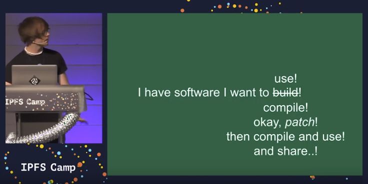
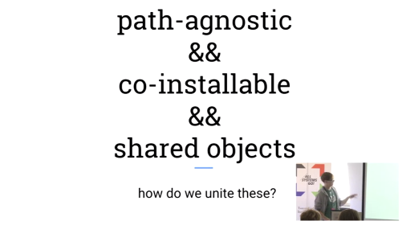
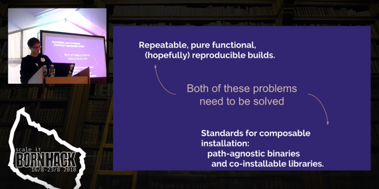

+++
title = "More"
weight = 200
pre = "<b># </b>"
chapter = false
+++

Additional Resources
====================

Reference Projects
------------------

- [polydawn/catalog](https://github.com/polydawn/catalog) -- a git repo containing a snapshot of a [Timeless Catalog](/glossary#catalog) with a handful of projects tracked.
- [polydawn/radix](https://github.com/polydawn/radix) -- a repo containing the work-in-progress of the Radix project, this is also chock full of working examples of using [Reach](/getting-started/hello-reach).
	- especially [radix//docs](https://github.com/polydawn/radix/tree/master/docs) has some useful outlines of scope and important techniques.
	- especially [radix//workspace/...](https://github.com/polydawn/radix/tree/master/workspace/early.radix.polydawn.io) has some interesting worked examples of builds.

Talks, Slides & Recordings
---------------------------

Here are some other talks and recordings about the Timeless Stack components,
as well as about our take on software packaging:

#### Solving the distributed naming problem in package management -- at IPFS Camp 2019

This talk covers problems from a very meta level, and is barely specific to Repeatr and the Timeless Stack at all.  It also does not regard Radix.  That said, it's the shortest thing, and covers the problem space well, and so is **probably the *one thing* on this page you should definitely watch**.

- Recording: [link](https://www.youtube.com/watch?v=z7VKDD0pbJU) (video; youtube) (_7 minutes_)
- Slides: [link](https://docs.google.com/presentation/d/1_uf0g2Ql1WWAgfZjahsnT28oaUT7P19Iw6qDYJUNO3U/edit?usp=sharing) (google slides)

#### Path-agnostic binaries, co-installable libraries, and How To Have Nice Things -- at All Systems Go 2018

This talk is fairly heavy on technical details: it talks about binaries, dynamic linking strategies, and system design.  While the Timeless Stack is not discussed, the concepts regarded here are central to Radix design -- particularly the linking strategy proposed at the end of the talk.

- Abstract: [link](https://cfp.all-systems-go.io/en/ASG2018/public/events/204) (html)
- Recording: [link](https://media.ccc.de/v/ASG2018-204-path-agnostic_binaries_co-installable_libraries_and_how_to_have_nice_things)  (video; CCC) (_23 minutes_)
- Slides: [link](https://docs.google.com/presentation/d/e/2PACX-1vRUkAAMNNEPbK4HR1OEYfqktsOiDtKqlLLiBsNdg9DL73W2lGNr5OpEsM7fhwZ1xnXQwl57DheDejNR/pub?slide=id.p) (google slides)

#### Repeatable, functional builds with Repeatr -- at Bornhack 2018

This talk focuses concretely on Repeatr.  If you want a deep dive with lots of concrete examples, this may be useful.

- Abstract: [link](https://bornhack.dk/bornhack-2018/program/#/event/repeatable-functional-builds-with-repeatr) (html)
- Recording: [link](https://www.youtube.com/watch?v=mvr9wb_slYY) (video; youtube) (_58 minutes_)

(Note: towards the end of the talk, I made some misstatements about dynamic linking details, which were (correctly) questioned by the audience!
Thank you to those audience members; and these details are more correctly discussed in the
["Path-agnostic binaries" talk](#path-agnostic-binaries-co-installable-libraries-and-how-to-have-nice-things-at-all-systems-go-2018) at ASG2018.)

#### Containers: What Did We Learn? -- at All Systems Go 2017

This talk is very abstract, and discusses the evolution of container systems, the user experience around them, and the need for rethinking our designs thereabouts.
It does not concretely refer to the Timeless Stack, but it's likely you can see the outline of the ideas and definitely the fundamental motivations.
(This is a particularly great talk to watch if your question relates to "Why not {Docker|Flatpack|Snaps|etc}?")

- Abstract: [link](https://cfp.all-systems-go.io/en/ASG2017/public/events/100) (html)
- Recording: [link](https://media.ccc.de/v/ASG2017-100-containers_what_did_we_learn) (video; CCC) (_17 minutes_)
